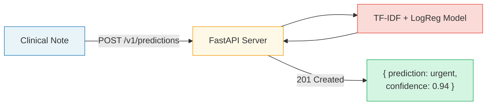

# REST-API-Builder

A self-paced, hands-on tutorial that teaches you how to **build, test, and deploy a REST API** that serves a machine learning model — using fictious healthcare examples throughout.

By the end, you will have a working API that classifies clinical notes as **urgent** or **routine**, tested with pytest, deployed to the cloud, and powered by an LLM for explanations.

---

## Who Is This For?

Researchers and data scientists who:
- Have basic Python knowledge
- Have completed (or are familiar with) the [ci-cd-template](https://github.com/po-DRA/ci-cd-template) tutorial
- Want to learn how to serve ML models as REST APIs
- Are new to web APIs, HTTP, and deployment

---

## What You'll Build

A **Clinical Urgency Prediction API** that:
1. Accepts a clinical note (free text)
2. Classifies it as `urgent` or `routine`
3. Returns the prediction with a confidence score
4. Stores predictions for later retrieval
5. Is deployed and accessible via the internet
6. Uses an LLM to explain why a note is urgent or routine



---

## Why a REST API (and Not Just pip install)?

| | **pip install (library)** | **REST API (service)** |
|---|---|---|
| **Users** | Python developers only | Anyone — any language, any device |
| **Setup** | Must install Python + all dependencies | Just needs HTTP (curl, browser, any language) |
| **Updates** | Every user must upgrade | Deploy once, everyone gets the new version |
| **Access control** | None | API keys, rate limits, audit logs |
| **Best for** | Reusable Python utilities | Serving predictions to apps, dashboards, teams |

**Bottom line:** Use a library when consumers are Python devs who want full control. Use an API when you want *anyone* to use your model without installing anything.

---

## Learning Path

| Lab | Topic |
|---|---|
| [Lab 00](lab_00_rest_fundamentals/README.md) | REST Fundamentals — HTTP verbs, status codes, URL design | 
| [Lab 01](lab_01_your_first_api/README.md) | Your First API — FastAPI CRUD with all 5 HTTP verbs |
| [Lab 02](lab_02_train_model/README.md) | Train the Model — TF-IDF + Logistic Regression pipeline | 
| [Lab 03](lab_03_expose_model/README.md) | Expose the Model — Serve predictions as a REST API | 
| [Lab 04](lab_04_test_api/README.md) | Test the API — pytest with FastAPI TestClient |
| [Lab 05](lab_05_deploy/README.md) | Deploy — Render, HuggingFace Spaces, or Docker |
| [Lab 06](lab_06_llm_api/README.md) | LLM API — Call HuggingFace, build a wrapper API, and evaluate LLM outputs |

**Total:** ~3 hours

---

## Quick Start

### Option 1: GitHub Codespaces (Recommended)

Click **Code → Codespaces → Create codespace on main**.
Everything is pre-configured via `.devcontainer/devcontainer.json`.

### Option 2: Local Setup

```bash
# Clone the repo
git clone https://github.com/<your-username>/REST-API-Builder.git
cd REST-API-Builder

# Install uv (fast Python package manager) if you don't have it
pip install uv

# Install all dependencies (creates a .venv automatically)
uv sync --extra dev

# Start with Lab 00!
```

---

## Folder Structure

```
REST-API-Builder/
├── README.md                    ← You are here
├── pyproject.toml               ← Dependencies, tool config (ruff, pytest)
├── render.yaml                  ← Render deployment config
├── Dockerfile                   ← Docker / HuggingFace Spaces config
├── .gitignore
├── .devcontainer/
│   └── devcontainer.json        ← Codespaces / Dev Container config
├── data/
│   └── clinical_notes.csv       ← 30 labelled clinical notes
├── models/
│   └── README.md                ← Generated model files go here
├── solutions/
│   ├── lab_00_answers.md        ← Quiz answers for Lab 00
│   ├── lab_01_challenge3.md     ← Solution for Lab 01 stretch challenge
│   ├── lab_03_challenges.md     ← Solutions for Lab 03 challenges
│   ├── lab_04_challenges.md     ← Solutions for Lab 04 challenges
│   └── lab_06_challenges.md     ← Solutions for Lab 06 challenges
├── lab_00_rest_fundamentals/
│   └── README.md                ← REST theory + quiz
├── lab_01_your_first_api/
│   ├── app.py                   ← FastAPI CRUD server
│   └── README.md
├── lab_02_train_model/
│   ├── train.py                 ← Train the urgency classifier
│   └── README.md
├── lab_03_expose_model/
│   ├── app.py                   ← ML model as REST API
│   └── README.md
├── lab_04_test_api/
│   ├── test_api.py              ← pytest tests
│   └── README.md
├── lab_05_deploy/
│   ├── app.py                   ← Production-ready app
│   └── README.md
└── lab_06_llm_api/
    ├── app.py                   ← LLM wrapper API
    ├── test_app.py              ← API tests + LLM output evals
    └── README.md
```

---

## Reference Materials

These resources are linked throughout the labs:

| Resource | Link |
|---|---|
| REST API Cheatsheet | [ByteByteGo](https://bytebytego.com/guides/rest-api-cheatsheet/) |
| API Learning Roadmap | [ByteByteGo](https://bytebytego.com/guides/the-ultimate-api-learning-roadmap/) |
| What is an API | [IBM](https://www.ibm.com/topics/api) |
| API Lifecycle | [IBM](https://www.ibm.com/think/topics/api-lifecycle) |
| OpenAPI Intro | [Swagger](https://swagger.io/docs/specification/about/) |
| OpenAPI Specification | [Swagger](https://swagger.io/specification/) |
| FastAPI Docs | [fastapi.tiangolo.com](https://fastapi.tiangolo.com/) |
| Build FastAPI in Minutes | [Real Python](https://realpython.com/fastapi-python-web-apis/) |
| Different Types of APIs | [Postman Blog](https://blog.postman.com/different-types-of-apis/) |
| HuggingFace Inference API | [huggingface.co/docs/api-inference](https://huggingface.co/docs/api-inference/) |
| Training Script Inspiration | [ci-cd-template](https://github.com/po-DRA/ci-cd-template/blob/main/scripts/train.py) |

---

## License

This project is licensed under the [MIT License](LICENSE).

---

## Citation

If you use this template for teaching, research, or derivative work, please cite it:

```bibtex
@software{ojha_rest_api_builder,
  author  = {Ojha, Priyanka},
  orcid   = {https://orcid.org/0000-0002-6844-6493},
  title   = {REST-API-Builder: Hands-on REST API Tutorial for ML},
  url     = {https://github.com/po-DRA/API},
  version = {1.0.0},
  year    = {2026},
  license = {MIT}
}
```

## Acknowledgements

This teaching material, code, documentation, diagrams, and README were developed by a human educator with AI assistance from **[Claude](https://claude.ai)** (Anthropic) , used as a pair-programming partner for debugging, drafting, and refining content throughout the project. It was tested by a real human.
