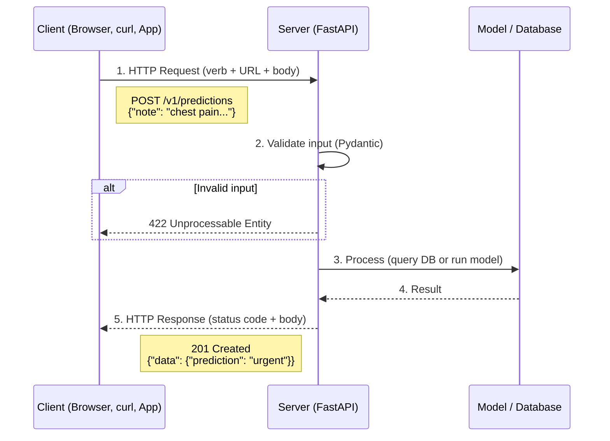

# Lab 00: REST Fundamentals

> **Goal:** Understand what REST is, how HTTP works, and why these ideas
> matter before you write a single line of API code.

> **Time:** ~30 minutes of reading + quiz

---

## Why Should a Researcher Care About APIs?

Imagine you have trained a brilliant model that predicts clinical urgency
from free-text notes.  Right now it lives inside a Jupyter notebook on
your laptop.  To let **anyone else** use it - a colleague, a dashboard,
a mobile app, another service - you need to wrap it in an **API**
(Application Programming Interface).

> 📖 Read more: [What is an API? (IBM)](https://www.ibm.com/topics/api)

### API vs. pip install: When to Use Which

| | **pip install (library)** | **REST API (service)** |
|---|---|---|
| **Who uses it** | Python developers only | Anyone - Python, JavaScript, mobile apps, curl |
| **Where it runs** | On the caller's machine | On a server you control |
| **Dependencies** | Caller must install everything (scikit-learn, pandas…) | Caller needs only HTTP - zero setup |
| **Updates** | Every user must `pip install --upgrade` | You deploy once; everyone gets the new version instantly |
| **Access control** | None - anyone with the package can use it | You can add API keys, rate limits, logging |
| **Data privacy** | Data stays on the caller's machine | Data is sent to your server (you control security) |
| **Best for** | Reusable utilities, offline analysis | Serving predictions, dashboards, cross-language integrations |

**Rule of thumb:**
- Use a **library** when the consumer is a Python developer who wants full control.
- Use an **API** when you want *anyone* (any language, any device) to use your model
  without installing anything.

In healthcare, APIs are especially useful: you can put the model behind
authentication, log every prediction for auditing, and update the model
without asking every clinical team to reinstall software.

---

## The 6 REST Principles (in Plain English)

REST stands for **RE**presentational **S**tate **T**ransfer.  It is not a
protocol or a library. It is a set of *architectural principles* that
make APIs predictable, scalable, and easy to use.

> 📖 Keep the [ByteByteGo REST API Cheatsheet](https://bytebytego.com/guides/rest-api-cheatsheet/)
> open as you read. It's a great visual companion.

### 1. Client–Server Separation

The **client** (e.g. a React dashboard) and the **server** (your
FastAPI app) are independent.  The client doesn't know how the model
was trained; the server doesn't know whether the client is a phone or
a laptop.

*Healthcare example:* An EHR system (client) sends a clinical note to
your prediction API (server).  Neither cares about the other's tech
stack.

### 2. Statelessness

Every request from the client must contain **all the information** the
server needs.  The server does not remember previous requests.

*Why this matters:* If a nurse sends two prediction requests, the
server doesn't need to remember the first one to handle the second.
This makes scaling easy: you can run 10 copies of the server and any
copy can handle any request.

### 3. Cacheability

Responses should say whether they can be cached.  A `GET` request for
patient demographics changes rarely and is safe to cache.  A `POST`
that creates a new prediction is not.

### 4. Uniform Interface

Every REST API uses the same HTTP verbs (`GET`, `POST`, etc.) and the
same URL conventions.  Once you learn one REST API, you can use any
REST API.

### 5. Layered System

Between the client and server there can be load balancers, caches,
authentication proxies. The client doesn't know or care.

### 6. Code on Demand (optional)

The server *can* send executable code (like JavaScript) to the client.
This is rarely used in data-science APIs, so don't worry about it.

---

## HTTP Verbs: The 5 Actions You Can Take

Think of a REST API as a filing cabinet.  The **URL** tells you *which
drawer* (resource) you want.  The **HTTP verb** tells you *what you
want to do* with it.

> 📖 See these verbs in context on the
> [ByteByteGo REST API Cheatsheet](https://bytebytego.com/guides/rest-api-cheatsheet/).

| Verb | What It Does | Medical Example | Typical Success Code |
|---|---|---|---|
| **GET** | Read / retrieve data | Get a patient's lab results | `200 OK` |
| **POST** | Create a new resource | Submit a new clinical note for prediction | `201 Created` |
| **PUT** | Replace a resource entirely | Replace a patient's full allergy profile | `200 OK` |
| **PATCH** | Update part of a resource | Change just the phone number on a patient record | `200 OK` |
| **DELETE** | Remove a resource | Remove a cancelled appointment | `204 No Content` |

### Key distinctions

- **POST vs. PUT:** POST *creates* something new (the server assigns an
  ID).  PUT *replaces* an existing item (the client knows the ID).
- **PUT vs. PATCH:** PUT sends the *complete* new version.  PATCH sends
  only the fields that changed.
- **DELETE returns 204**: this means "success, but there is nothing to
  send back" (the thing is gone!).

---

## How a Request-Response Cycle Works

Every time you call an API, the same cycle happens:



**In plain English:**
1. The **client** sends a request. The HTTP verb says *what to do*, the URL says *to what*, and the body carries *the data*.
2. The **server** validates the input. Bad data gets rejected immediately with 422.
3. The server **processes** the request: querying a database, running a model, etc.
4. The server sends back a **response**: a status code (201, 404, etc.) and a JSON body.

This exact cycle happens whether you're using curl, a browser, a React dashboard, or a mobile app. That's the power of REST: the client and server don't care about each other's technology.

---

## Try It Yourself: Testing APIs with curl

`curl` is a command-line tool that sends HTTP requests. It comes
pre-installed on macOS, Linux, and Windows 10+. Think of it as a
browser for your terminal, but instead of rendering a web page, it
shows you the raw response.

### Check if any API is alive

```bash
# Hit a public API - no setup needed
curl https://httpbin.org/get
```

You should see a JSON response. If you do, the API is working.

### Useful curl flags

```bash
# See the status code and headers (not just the body)
curl -v https://httpbin.org/get

# Send a POST request with JSON data
curl -X POST https://httpbin.org/post \
  -H "Content-Type: application/json" \
  -d '{"name": "Jane", "age": 45}'

# Just show the HTTP status code (quick health check)
curl -o /dev/null -s -w "%{http_code}\n" https://httpbin.org/get
```

### Once you build your own API (Lab 01)

```bash
# Check if your server is running
curl http://127.0.0.1:8000/

# List all patients
curl http://127.0.0.1:8000/v1/patients

# Create a patient (POST)
curl -X POST http://127.0.0.1:8000/v1/patients \
  -H "Content-Type: application/json" \
  -d '{"name": "Jane Doe", "age": 45, "gender": "female"}'
```

> **Tip:** You don't need curl to complete this tutorial. The FastAPI
> Swagger UI at `/docs` lets you do everything in the browser. But
> knowing curl is useful for quick checks, scripting, and debugging
> any API you encounter in the wild.

---

## HTTP Status Codes: What the Server Tells You

Status codes are the server's way of saying what happened.  They are
grouped by the first digit:

| Range | Meaning | Think of it as… |
|---|---|---|
| **2xx** | ✅ Success | "All good!" |
| **4xx** | ❌ Client error | "You did something wrong." |
| **5xx** | 💥 Server error | "We messed up." |

### The codes you'll use most often

| Code | Name | When to Use It | Example |
|---|---|---|---|
| `200` | OK | Successful GET, PUT, or PATCH | `GET /v1/patients/42` → returns patient data |
| `201` | Created | Successful POST that created something | `POST /v1/predictions` → new prediction stored |
| `204` | No Content | Successful DELETE (nothing to return) | `DELETE /v1/predictions/7` → prediction removed |
| `400` | Bad Request | Request is malformed or missing fields | Sending JSON without a required `note` field |
| `401` | Unauthorized | No credentials provided | Calling the API without an API key |
| `403` | Forbidden | Credentials valid, but not enough permission | A read-only user trying to DELETE |
| `404` | Not Found | The resource doesn't exist | `GET /v1/patients/99999` - no such patient |
| `422` | Unprocessable Entity | JSON is valid but values are wrong | `{"age": -5}` - age can't be negative |
| `500` | Internal Server Error | Bug in the server code | Unhandled exception in your Python code |
| `503` | Service Unavailable | Server is overloaded or down | Model file missing; API can't serve predictions |

> 📖 Bookmark the full list:
> [ByteByteGo REST API Cheatsheet](https://bytebytego.com/guides/rest-api-cheatsheet/)

---

## REST URL Design Rules

Good URLs are **predictable** and **readable**.  Follow these rules:

### 1. Use nouns, not verbs

```
✅  GET  /v1/patients          ← "get me the list of patients"
❌  GET  /v1/getPatients       ← the verb is already in the HTTP method!
```

### 2. Use plurals for collections

```
✅  /v1/patients
❌  /v1/patient
```

### 3. Version your API

Put the version in the URL so you can evolve without breaking old clients:

```
/v1/patients    ← version 1
/v2/patients    ← version 2, maybe different response format
```

### 4. Use path parameters for specific resources

```
GET /v1/patients/42          ← patient with ID 42
DELETE /v1/predictions/abc   ← prediction with ID abc
```

### 5. Use query parameters for filtering, sorting, and pagination

```
GET /v1/patients?status=active&limit=10&offset=0
                 ^^^^^^^^       ^^^^^   ^^^^^^
                 filter         page    skip
                                size    count
```

---

## Path Parameters vs. Query Parameters

This is a common point of confusion.  Here's the simple rule:

| Type | Where It Goes | Purpose | Example |
|---|---|---|---|
| **Path parameter** | Inside the URL path | Identify a *specific* resource | `/v1/patients/42` |
| **Query parameter** | After the `?` | Filter, sort, or paginate a *collection* | `/v1/patients?status=active` |

**In plain English:**
- Path params answer: **"Which one?"**
- Query params answer: **"Which subset? How many? In what order?"**

---

## The API Lifecycle

Before building, it helps to understand the typical stages an API goes through:

1. **Design:** Define endpoints, request/response shapes (OpenAPI spec)
2. **Build:** Implement with a framework like FastAPI
3. **Test:** Automated tests with pytest
4. **Deploy:** Ship to Render, HuggingFace Spaces, or Docker
5. **Monitor:** Track usage, errors, latency
6. **Iterate:** Version and improve

> 📖 Deep dive: [API Lifecycle (IBM)](https://www.ibm.com/think/topics/api-lifecycle)
>
> 📖 Learning path: [The Ultimate API Learning Roadmap (ByteByteGo)](https://bytebytego.com/guides/the-ultimate-api-learning-roadmap/)

---

## The OpenAPI Specification (Bonus)

FastAPI **automatically** generates an OpenAPI spec for your API.
OpenAPI is a standard way to describe your endpoints so that tools can
generate documentation, client libraries, and tests.

When you run a FastAPI server, visit:
- `/docs` - interactive Swagger UI (try endpoints in the browser!)
- `/redoc` - clean, readable docs
- `/openapi.json` - the raw spec

> 📖 More about OpenAPI:
> [About OpenAPI (Swagger)](https://swagger.io/docs/specification/about/) |
> [OpenAPI Specification](https://swagger.io/specification/)

---

## 📝 Quiz: Test Your Understanding

Answer these questions, then check your answers in
[solutions/lab_00_answers.md](../solutions/lab_00_answers.md).

1. You want to retrieve a list of all patients.  Which HTTP verb do you use?
2. You create a new prediction.  What status code should the server return?
3. You delete prediction #7.  What status code should the server return?
4. What is wrong with this URL: `GET /v1/getActivePatients`?
5. A client sends `GET /v1/patients/99999` but that patient doesn't exist.
   What status code should the server return?
6. What is the difference between a path parameter and a query parameter?
   Give an example of each.
7. Why is statelessness important for scaling an API?
8. Your colleague says "just pip install my model."  Give two reasons
   why wrapping it in a REST API might be a better choice.
9. What does a `422 Unprocessable Entity` status code mean?
10. Name two things FastAPI auto-generates from the OpenAPI spec.

---

## ✅ Done When

- [ ] You can name all 5 HTTP verbs and when to use each
- [ ] You know the difference between 200, 201, and 204
- [ ] You understand path params vs. query params
- [ ] You can explain why a REST API is better than `pip install` for
      serving a model to non-Python users
- [ ] You completed the quiz and checked your answers

---

**Next →** [Lab 01: Your First API](../lab_01_your_first_api/README.md)
