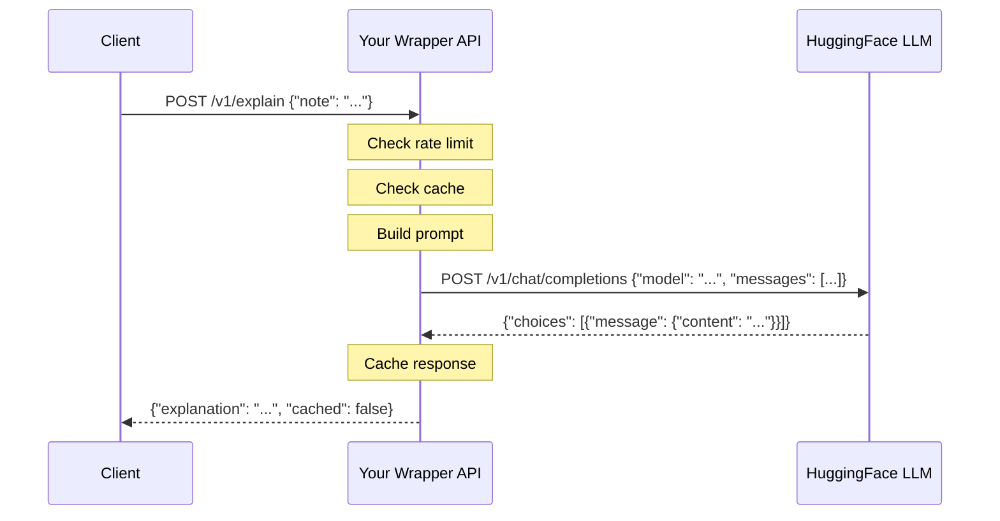

# Lab 06 — Build an LLM-Powered API

> **Goal:** Learn to call an external LLM API (HuggingFace) and build
> a wrapper API that adds prompt engineering, rate limiting, and caching.

> **Time:** ~30 minutes

> **Prerequisites:**
> [Lab 05 — Deploy](../lab_05_deploy/README.md)

---

## What You'll Learn

- How to call an external API using `requests` (raw REST)
- How to manage API keys safely (environment variables)
- How LLM parameters work (temperature, max_tokens)
- How to build a wrapper API (your API calling another API)
- How to handle rate limits and cache responses
- The difference between ML models (fast, specific) and LLMs (flexible, slower)

---

## Why a Wrapper API?

In Labs 01-05, you **built** an API. Now you'll **consume** one — and
wrap it in your own API. This is how most AI products work:



**Why not let clients call HuggingFace directly?**

| Direct call | Wrapper API |
|---|---|
| Client needs the API key | Key stays on your server |
| Client must learn prompt engineering | You control the prompt |
| No rate limiting | You enforce limits |
| No caching | Identical requests are instant |
| Tied to one LLM provider | Swap providers without changing clients |

---

## Setup

### 1. Get a Free HuggingFace Token

1. **Sign up** at [huggingface.co/join](https://huggingface.co/join)
   (free, no credit card needed)
2. **Create a token** at
   [huggingface.co/settings/tokens](https://huggingface.co/settings/tokens/new?ownUserPermissions=inference.serverless.write&tokenType=fineGrained)
   — choose "Fine-grained" with "Make calls to Inference Providers"
3. **Copy the token** (starts with `hf_...`)

### 2. Set the Token as an Environment Variable

```bash
# Linux / Mac / Codespaces:
export HF_TOKEN="hf_your_token_here"

# Windows PowerShell:
$env:HF_TOKEN = "hf_your_token_here"

# Windows CMD:
set HF_TOKEN=hf_your_token_here
```

> **Security rule:** NEVER put API keys in your code or commit them
> to git. Environment variables keep secrets out of your repository.
> This is industry-standard practice
> ([12-factor app](https://12factor.net/config)).

### 3. Start the API

```bash
# Go to the project root if you're not already there
cd ..

# Start the LLM API (on port 8001 so it doesn't conflict with Lab 03)
cd lab_06_llm_api
uvicorn app:app --reload --port 8001
```

Open [http://127.0.0.1:8001/play](http://127.0.0.1:8001/play) for the
interactive playground, or [/docs](http://127.0.0.1:8001/docs) for the
Swagger UI.

---

## Endpoints Overview

| Method | Endpoint | What It Does | Status Code |
|---|---|---|---|
| GET | `/` | Welcome page | 200 |
| GET | `/play` | Interactive web playground | 200 |
| POST | `/v1/explain` | Get an LLM explanation for a clinical note | 201 |
| GET | `/v1/models` | List recommended models | 200 |
| GET | `/v1/rate-limit` | Check rate limit status | 200 |

---

## Try It

### Step 1: Check the API is running

```bash
curl http://127.0.0.1:8001/
```

### Step 2: Get an explanation for a clinical note

```bash
curl -X POST http://127.0.0.1:8001/v1/explain \
  -H "Content-Type: application/json" \
  -d '{"note": "Patient presents with acute chest pain, ST-elevation on ECG, and elevated troponin levels"}'
```

Expected response (201 Created):
```json
{
  "data": {
    "id": "abc-123...",
    "note": "Patient presents with acute chest pain...",
    "explanation": "This note suggests an urgent case. ST-elevation on ECG indicates a possible myocardial infarction...",
    "model_used": "mistralai/Mistral-7B-Instruct-v0.3",
    "temperature": 0.7,
    "max_tokens": 150,
    "cached": false,
    "created_at": "2026-..."
  },
  "meta": {"rate_limit_remaining": 9}
}
```

> **Note:** The first request to a model may take 20-30 seconds while
> HuggingFace loads it. Subsequent requests are much faster.

### Step 3: Try different LLM parameters

```bash
# More creative (higher temperature)
curl -X POST http://127.0.0.1:8001/v1/explain \
  -H "Content-Type: application/json" \
  -d '{"note": "Patient has mild seasonal allergies, requesting refill", "temperature": 1.5}'

# More focused (lower temperature)
curl -X POST http://127.0.0.1:8001/v1/explain \
  -H "Content-Type: application/json" \
  -d '{"note": "Patient has mild seasonal allergies, requesting refill", "temperature": 0.1}'
```

### Step 4: Check caching

Send the same note twice — the second response will say `"cached": true`
and return instantly:

```bash
# First call — hits the LLM (slow)
curl -X POST http://127.0.0.1:8001/v1/explain \
  -H "Content-Type: application/json" \
  -d '{"note": "Routine annual wellness check. All vitals normal."}'

# Second call — from cache (instant!)
curl -X POST http://127.0.0.1:8001/v1/explain \
  -H "Content-Type: application/json" \
  -d '{"note": "Routine annual wellness check. All vitals normal."}'
```

### Step 5: Check rate limit

```bash
curl http://127.0.0.1:8001/v1/rate-limit
```

### Step 6: Browse available models

```bash
curl http://127.0.0.1:8001/v1/models
```

### Step 7: Try a different model

```bash
curl -X POST http://127.0.0.1:8001/v1/explain \
  -H "Content-Type: application/json" \
  -d '{"note": "Severe sepsis with lactate 4.2 and falling blood pressure", "model": "google/gemma-2-2b-it"}'
```

---

## Understanding LLM Parameters

| Parameter | What It Does | Low Value | High Value |
|---|---|---|---|
| **temperature** | Controls randomness | 0.1 = focused, deterministic | 1.5 = creative, varied |
| **max_tokens** | Maximum response length | 10 = very short | 500 = detailed |

**Temperature intuition:**
- `0.1` — The LLM picks the most likely next word every time. Same
  input = same output. Good for factual tasks.
- `0.7` — Some randomness. Good balance for most tasks (this is the
  default).
- `1.5` — Very random. Different output each time. Good for creative
  tasks, bad for clinical analysis.

Try the same note with temperature 0.1 and 1.5 to see the difference!

---

## Key Architecture Decisions

Read through [app.py](app.py) — every decision is commented. The
highlights:

1. **Wrapper pattern** — Your API adds value on top of the raw LLM API:
   prompt engineering, rate limiting, caching, error handling. Clients
   just send a note and get back an explanation.

2. **API key in environment variable** — Never hardcoded, never
   committed to git. This is the #1 security rule for API keys.

3. **Rate limiting** — Simple in-memory counter that enforces a max
   requests per minute. Returns HTTP 429 (Too Many Requests) when
   exceeded — the standard REST status code for rate limiting.

4. **Response caching** — Identical requests return cached results
   instantly. Saves API quota and reduces latency.

5. **Error handling for external APIs** — Handles timeouts (504),
   connection errors (502), auth failures (503), and rate limits (429)
   from HuggingFace.

---

## ML Model vs LLM — When to Use Which?

| | Your ML Model (Lab 03) | LLM (Lab 06) |
|---|---|---|
| **Speed** | ~1 ms | ~2-10 seconds |
| **Cost** | Free (runs locally) | API quota / paid |
| **Task** | Classification (urgent/routine) | Open-ended text generation |
| **Accuracy** | High for trained categories | Depends on prompt |
| **Best for** | Fast, specific decisions | Explanations, summaries, Q&A |

**In production, you combine both:**
- ML model for fast classification (triage thousands of notes/second)
- LLM for detailed explanations (on-demand, when a clinician asks "why?")

---

## A Note on Caching: From Dict to Redis

In this lab, we use a simple **Python dictionary** as our cache:

```python
llm_cache: dict[str, dict] = {}
```

This works great for learning, but it has limitations:

| | Python dict (this lab) | Redis (production) |
|---|---|---|
| **Setup** | Nothing — just works | Install and run Redis server |
| **Persistence** | Lost when the app restarts | Survives restarts |
| **Multiple workers** | Each worker has its own cache | Shared across all workers |
| **Memory** | Grows forever (no eviction) | Auto-evicts old entries (LRU) |
| **Best for** | Learning, prototyping | Production APIs |

In production, you'd replace the dict with
[Redis](https://redis.io/) — an in-memory data store designed for
exactly this use case:

```python
# What production code looks like (future topic!):
import redis

cache = redis.StrictRedis(host="localhost", port=6379, decode_responses=True)

# Store with a 1-hour expiry (auto-cleanup!)
cache.setex(cache_key, 3600, json.dumps(record))

# Retrieve
cached = cache.get(cache_key)
```

Redis also powers rate limiting, session storage, and real-time
leaderboards. It's one of the most widely used tools in API
infrastructure — a great next topic to explore.

---

## Challenges

See the YOUR TURN section at the bottom of [app.py](app.py):

1. **(Easy)** Add a cache stats endpoint
2. **(Medium)** Add a summarize endpoint with a different prompt
3. **(Stretch)** Combine ML model + LLM in one endpoint

---

## Done When

- [ ] You can POST a clinical note and get an LLM explanation back
- [ ] You understand how temperature affects LLM responses
- [ ] You can see caching in action (second request is instant)
- [ ] You can check your rate limit status
- [ ] You can explain why a wrapper API is better than direct LLM calls
- [ ] You attempted at least one challenge

---

**Congratulations!** You've completed the full REST-API-Builder tutorial.
You can now build APIs, consume APIs, and combine ML models with LLMs.
